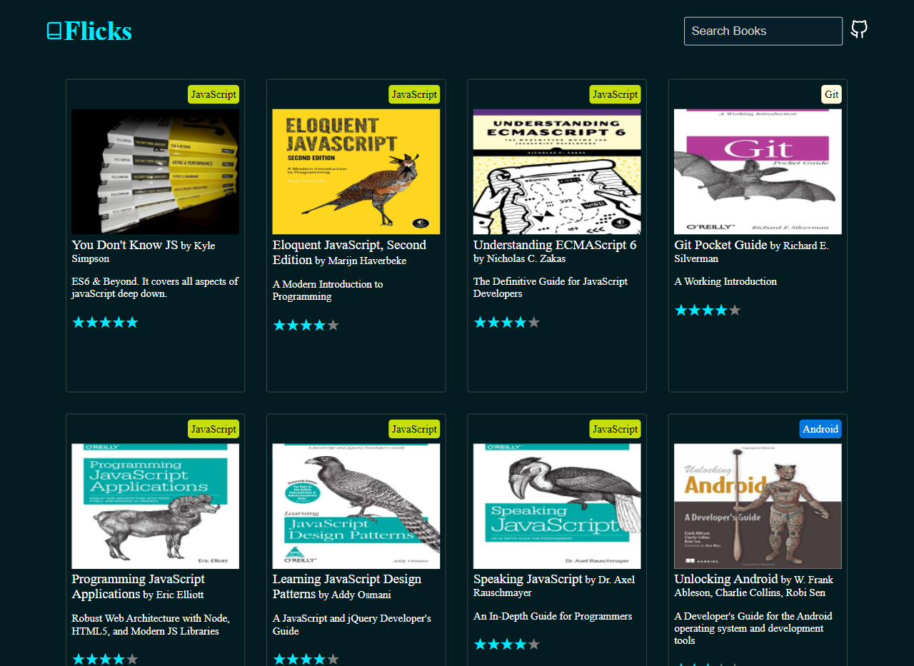
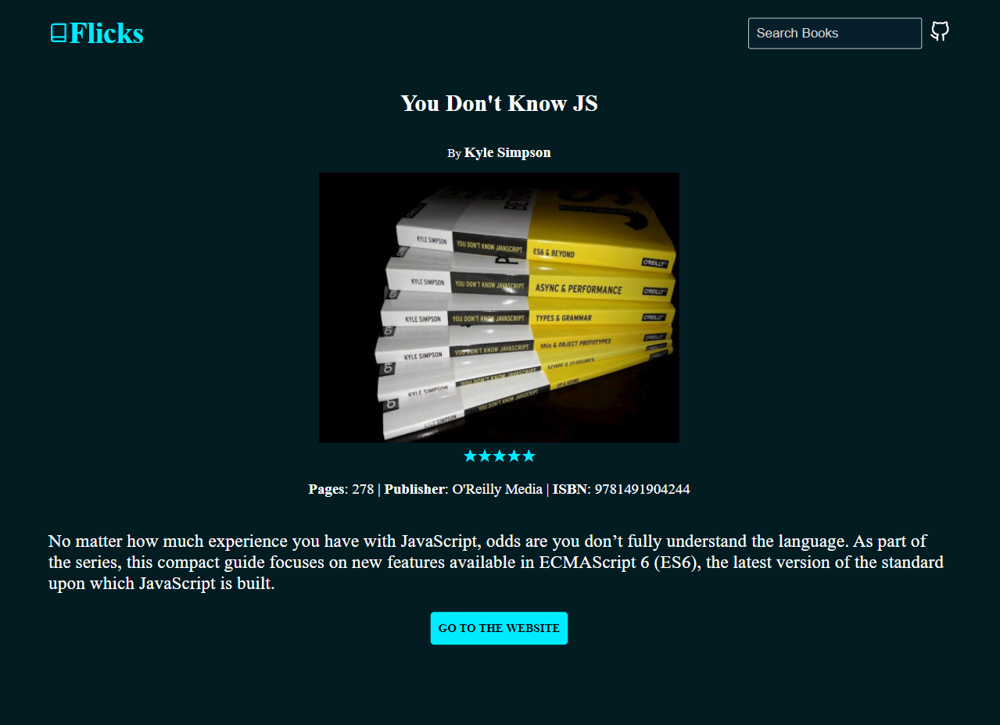
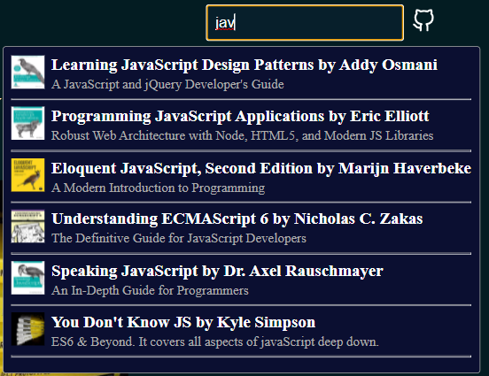

  

<h1 align="center">
  Flicks - Know My Favorite Books
</h1>

`Flicks` is a project to showcase the integration between `Gatsbyjs` and `HarperDB`. It provides a Gatsby-based user interface pulling data from the HarperDB. So you can assume it to be a library showing information about my favorite books!

> Please feel free to fork and change the project in whatever ways you need to. If you like the work, please show your support by giving the repo a star(⭐)

## 💻 Demo
`Flicks` is deployed on the Gatsby Cloud. You can access it using, [https://flicks.gatsbyjs.io/](https://flicks.gatsbyjs.io/)
## 📚 Quickstart

1. Clone the project and browse the project repo.
2. Install dependencies using `npm install`.
3. Follow this step-by-step tutorial to set up data with `HarperDB`.
4. Start the UI using the `gatsby develop` command.
5. Open the code and start customizing! The app is now running at http://localhost:8000!

## 🖼️ Screenshots
### The Book List Page

### The Book Details Page

### The Search Component

## 🚀 Deploy on Gatsby Cloud

Deploy this starter with one click on [Gatsby Cloud](https://www.gatsbyjs.com/cloud/):

